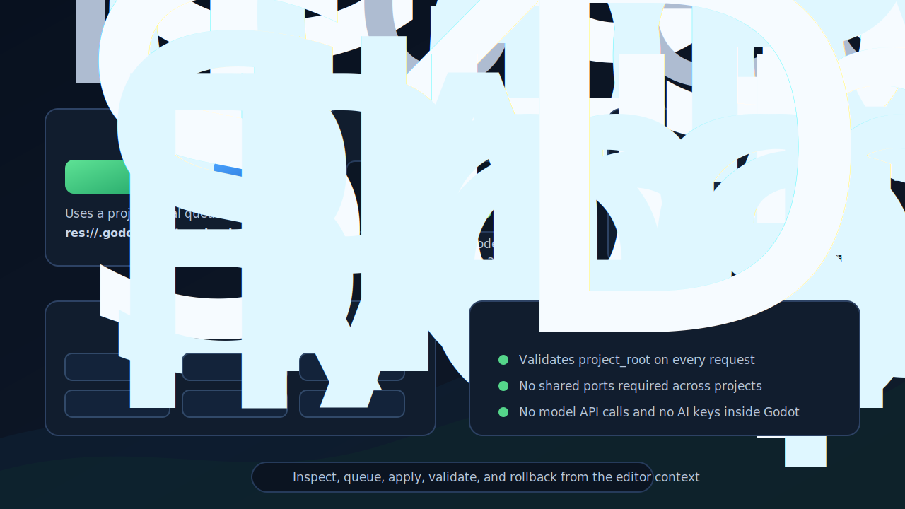
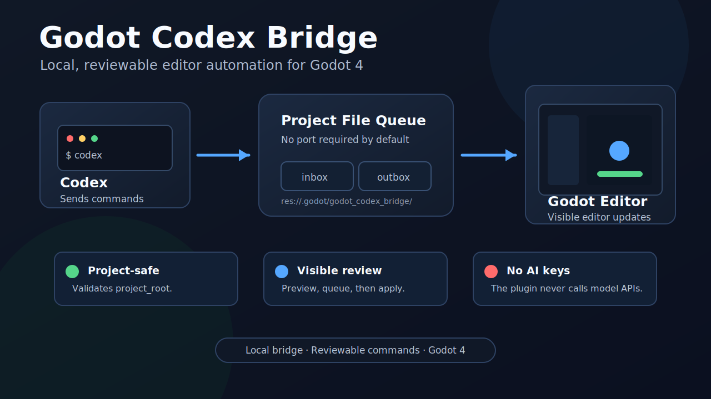

# Godot Codex Bridge

Experimental local bridge for letting coding agents inspect and operate the Godot editor through explicit, reviewable commands.



Godot Codex Bridge does not call any AI model API. It does not store model keys. The agent runs outside Godot and sends local commands to this plugin.

> Status: Alpha. Tested with Godot 4.6. Expect rough edges and keep backups.

## What It Is

Godot Codex Bridge is a small Godot editor plugin that exposes a controlled command surface to local coding agents. Instead of asking an agent to silently edit files from outside the editor, the bridge gives the agent a way to inspect the current Godot project, select nodes, open scenes, preview changes, queue actions, apply them with snapshots, and run validation from inside the editor context.

The goal is not to replace the Godot editor. The goal is to let an agent work with the editor in a way that is visible, project-scoped, and reversible.

## How It Works



The default transport is a project-local file queue:

1. A client writes a JSON request to `res://.godot/godot_codex_bridge/inbox`.
2. The plugin validates the request and the target project.
3. The plugin executes the supported editor command.
4. A JSON response is written to `res://.godot/godot_codex_bridge/outbox`.
5. The dock updates so the user can see the latest command and result.

This design avoids port conflicts when multiple Godot projects are open. Optional TCP is still available for local-only workflows that need it.

## Features

- File-queue transport by default, so no port is required.
- Optional TCP transport on `127.0.0.1`.
- Project isolation through `project_root` validation.
- Godot dock showing the active project, queue paths, recent command, snapshots, and run reports.
- Command history in `.godot/godot_codex_bridge/history.jsonl`.
- Pending action queue: preview first, apply later.
- Automatic snapshots before scene/file-changing operations.
- Snapshot restore for changed files and saved scenes.
- Headless Godot checks with captured errors and warnings.
- Editor commands for scene tree, selection, Inspector properties, Project Settings, Input Map, resources, and `AnimationPlayer` editing.

## Installation

1. Copy `addons/godot_codex_bridge/` into your Godot project.
2. Copy `tools/godot_bridge_send.sh` if you want the shell helper.
3. Enable **Godot Codex Bridge** in `Project > Project Settings > Plugins`.
4. The **Codex Bridge** dock should appear on the right side of the editor.

The default file bridge uses this project-local queue:

```text
res://.godot/godot_codex_bridge/inbox
res://.godot/godot_codex_bridge/outbox
```

## Quick Start

From your Godot project root:

```bash
tools/godot_bridge_send.sh ping
tools/godot_bridge_send.sh get_project_identity
tools/godot_bridge_send.sh get_editor_context
tools/godot_bridge_send.sh --json '{"command":"select_node","node_path":"Player"}'
```

Queue a visible editor change:

```bash
tools/godot_bridge_send.sh --json '{
  "command": "queue_actions",
  "summary": "Add a Camera2D",
  "actions": [
    {"type": "add_node", "parent_path": ".", "node_type": "Camera2D", "name": "Camera2D"}
  ]
}'
```

Then inspect and apply:

```bash
tools/godot_bridge_send.sh get_pending_actions
tools/godot_bridge_send.sh --json '{"command":"apply_queued_actions","queue_id":"queue_..."}'
```

## Command Families

- Project and bridge status: `ping`, `get_project_identity`, `get_bridge_status`, `list_editor_capabilities`
- Scene inspection: `get_open_scene`, `get_scene_tree`, `get_editor_context`, `get_selection`, `get_node_details`
- Scene interaction: `select_node`, `save_scene`, `play_main_scene`, `play_current_scene`, `play_custom_scene`, `stop_playing_scene`
- Safe changes: `preview_actions`, `queue_actions`, `apply_queued_actions`, `discard_queued_actions`, `get_snapshots`, `restore_snapshot`
- Inspector: `get_inspector_properties`, `set_inspector_property`
- Project Settings: `get_project_settings`, `get_project_setting`, `set_project_setting`
- Input Map: `get_input_actions`, `add_input_action`, `remove_input_action`
- Resources: `get_resource_files`, `get_resource_info`, `get_resource_import_info`, `scan_resource_filesystem`, `reimport_resources`
- Animation: `get_animation_players`, `get_animation_player_info`, `create_animation`, `set_animation_properties`, `add_animation_value_key`
- Validation: `run_check_only`, `run_project_headless`, `get_last_run_report`

## Safety Model

Godot Codex Bridge is designed to make agent actions visible and reviewable:

- It validates the target `project_root` before executing requests.
- It rejects writes under `res://addons/godot_codex_bridge`.
- It supports dry-run previews.
- It supports a pending queue for user review.
- It creates snapshots before applying actions that touch files or the current scene.
- It stores runtime state inside the project-local `.godot/godot_codex_bridge/` directory, which should not be committed.

This is still an editor automation plugin. Do not run commands from agents you do not trust.

## Optional TCP Bridge

TCP is disabled by default. To enable it, set `codex_bridge/tcp_bridge_enabled=true` in `project.godot`, or launch Godot with:

```bash
CODEX_GODOT_TCP_BRIDGE_ENABLED=1 godot --editor --path .
```

TCP listens on `127.0.0.1`. If you need a token, set:

```bash
CODEX_GODOT_BRIDGE_TOKEN=your-token godot --editor --path .
```

Then include `"token":"your-token"` in each request.

## Development

This repository is also a minimal Godot project for testing the plugin.

Run checks:

```bash
/Applications/Godot.app/Contents/MacOS/Godot --headless --path . --check-only --quit
/Applications/Godot.app/Contents/MacOS/Godot --headless --path . -s tests/action_executor_smoke.gd
/Applications/Godot.app/Contents/MacOS/Godot --headless --path . -s tests/scene_action_executor_smoke.gd
/Applications/Godot.app/Contents/MacOS/Godot --headless --path . -s tests/control_bridge_smoke.gd
/Applications/Godot.app/Contents/MacOS/Godot --headless --path . -s tests/file_bridge_smoke.gd
```

Use your local Godot executable path if it differs from the macOS path above.

## License

MIT
